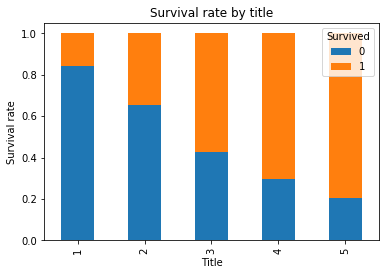

```python
# Data analysis
import pandas as pd

# Mathematical operations
import numpy as np

#OS
import os

#matplotlib
import matplotlib.pyplot as plt
# For plotting data inline
%matplotlib inline 
```


```python
workDir = "D:/pyProject/TitanicData"
os.chdir(workDir)
trn_data = pd.read_csv("train.csv")
tst_data = pd.read_csv("test.csv")
trn_data.head()
```


<div>
<style scoped>
    .dataframe tbody tr th:only-of-type {
        vertical-align: middle;
    }

    .dataframe tbody tr th {
        vertical-align: top;
    }

    .dataframe thead th {
        text-align: right;
    }
</style>
<table border="1" class="dataframe">
  <thead>
    <tr style="text-align: right;">
      <th></th>
      <th>PassengerId</th>
      <th>Survived</th>
      <th>Pclass</th>
      <th>Name</th>
      <th>Sex</th>
      <th>Age</th>
      <th>SibSp</th>
      <th>Parch</th>
      <th>Ticket</th>
      <th>Fare</th>
      <th>Cabin</th>
      <th>Embarked</th>
    </tr>
  </thead>
  <tbody>
    <tr>
      <th>0</th>
      <td>1</td>
      <td>0</td>
      <td>3</td>
      <td>Braund, Mr. Owen Harris</td>
      <td>male</td>
      <td>22.0</td>
      <td>1</td>
      <td>0</td>
      <td>A/5 21171</td>
      <td>7.2500</td>
      <td>NaN</td>
      <td>S</td>
    </tr>
    <tr>
      <th>1</th>
      <td>2</td>
      <td>1</td>
      <td>1</td>
      <td>Cumings, Mrs. John Bradley (Florence Briggs Th...</td>
      <td>female</td>
      <td>38.0</td>
      <td>1</td>
      <td>0</td>
      <td>PC 17599</td>
      <td>71.2833</td>
      <td>C85</td>
      <td>C</td>
    </tr>
    <tr>
      <th>2</th>
      <td>3</td>
      <td>1</td>
      <td>3</td>
      <td>Heikkinen, Miss. Laina</td>
      <td>female</td>
      <td>26.0</td>
      <td>0</td>
      <td>0</td>
      <td>STON/O2. 3101282</td>
      <td>7.9250</td>
      <td>NaN</td>
      <td>S</td>
    </tr>
    <tr>
      <th>3</th>
      <td>4</td>
      <td>1</td>
      <td>1</td>
      <td>Futrelle, Mrs. Jacques Heath (Lily May Peel)</td>
      <td>female</td>
      <td>35.0</td>
      <td>1</td>
      <td>0</td>
      <td>113803</td>
      <td>53.1000</td>
      <td>C123</td>
      <td>S</td>
    </tr>
    <tr>
      <th>4</th>
      <td>5</td>
      <td>0</td>
      <td>3</td>
      <td>Allen, Mr. William Henry</td>
      <td>male</td>
      <td>35.0</td>
      <td>0</td>
      <td>0</td>
      <td>373450</td>
      <td>8.0500</td>
      <td>NaN</td>
      <td>S</td>
    </tr>
  </tbody>
</table>
</div>


```python
trn_data.describe()
```


<div>
<style scoped>
    .dataframe tbody tr th:only-of-type {
        vertical-align: middle;
    }

    .dataframe tbody tr th {
        vertical-align: top;
    }

    .dataframe thead th {
        text-align: right;
    }
</style>
<table border="1" class="dataframe">
  <thead>
    <tr style="text-align: right;">
      <th></th>
      <th>PassengerId</th>
      <th>Survived</th>
      <th>Pclass</th>
      <th>Age</th>
      <th>SibSp</th>
      <th>Parch</th>
      <th>Fare</th>
    </tr>
  </thead>
  <tbody>
    <tr>
      <th>count</th>
      <td>891.000000</td>
      <td>891.000000</td>
      <td>891.000000</td>
      <td>714.000000</td>
      <td>891.000000</td>
      <td>891.000000</td>
      <td>891.000000</td>
    </tr>
    <tr>
      <th>mean</th>
      <td>446.000000</td>
      <td>0.383838</td>
      <td>2.308642</td>
      <td>29.699118</td>
      <td>0.523008</td>
      <td>0.381594</td>
      <td>32.204208</td>
    </tr>
    <tr>
      <th>std</th>
      <td>257.353842</td>
      <td>0.486592</td>
      <td>0.836071</td>
      <td>14.526497</td>
      <td>1.102743</td>
      <td>0.806057</td>
      <td>49.693429</td>
    </tr>
    <tr>
      <th>min</th>
      <td>1.000000</td>
      <td>0.000000</td>
      <td>1.000000</td>
      <td>0.420000</td>
      <td>0.000000</td>
      <td>0.000000</td>
      <td>0.000000</td>
    </tr>
    <tr>
      <th>25%</th>
      <td>223.500000</td>
      <td>0.000000</td>
      <td>2.000000</td>
      <td>20.125000</td>
      <td>0.000000</td>
      <td>0.000000</td>
      <td>7.910400</td>
    </tr>
    <tr>
      <th>50%</th>
      <td>446.000000</td>
      <td>0.000000</td>
      <td>3.000000</td>
      <td>28.000000</td>
      <td>0.000000</td>
      <td>0.000000</td>
      <td>14.454200</td>
    </tr>
    <tr>
      <th>75%</th>
      <td>668.500000</td>
      <td>1.000000</td>
      <td>3.000000</td>
      <td>38.000000</td>
      <td>1.000000</td>
      <td>0.000000</td>
      <td>31.000000</td>
    </tr>
    <tr>
      <th>max</th>
      <td>891.000000</td>
      <td>1.000000</td>
      <td>3.000000</td>
      <td>80.000000</td>
      <td>8.000000</td>
      <td>6.000000</td>
      <td>512.329200</td>
    </tr>
  </tbody>
</table>
</div>


```python
trn_data.info()
```

    <class 'pandas.core.frame.DataFrame'>
    RangeIndex: 891 entries, 0 to 890
    Data columns (total 12 columns):
    PassengerId    891 non-null int64
    Survived       891 non-null int64
    Pclass         891 non-null int64
    Name           891 non-null object
    Sex            891 non-null object
    Age            714 non-null float64
    SibSp          891 non-null int64
    Parch          891 non-null int64
    Ticket         891 non-null object
    Fare           891 non-null float64
    Cabin          204 non-null object
    Embarked       889 non-null object
    dtypes: float64(2), int64(5), object(5)
    memory usage: 83.6+ KB
    


```python

```


    'Futrelle, Mrs. Jacques Heath (Lily May Peel)'


```python
def get_title(name):
    if '.' in name:
        return name.split(',')[1].split('.')[0].strip()
    else:
        return 'Unknown'
    
def title_map(title):
    if title in ['Mr']:
        return 1
    elif title in ['Master']:
        return 3
    elif title in ['Ms','Mlle','Miss']:
        return 4
    elif title in ['Mme','Mrs']:
        return 5
    else:
        return 2

trn_data['title'] = trn_data['Name'].apply(get_title).apply(title_map)
tst_data['title'] = trn_data['Name'].apply(get_title).apply(title_map)

```


<div>
<style scoped>
    .dataframe tbody tr th:only-of-type {
        vertical-align: middle;
    }

    .dataframe tbody tr th {
        vertical-align: top;
    }

    .dataframe thead th {
        text-align: right;
    }
</style>
<table border="1" class="dataframe">
  <thead>
    <tr style="text-align: right;">
      <th></th>
      <th>PassengerId</th>
      <th>Pclass</th>
      <th>Name</th>
      <th>Sex</th>
      <th>Age</th>
      <th>SibSp</th>
      <th>Parch</th>
      <th>Ticket</th>
      <th>Fare</th>
      <th>Cabin</th>
      <th>Embarked</th>
      <th>title</th>
    </tr>
  </thead>
  <tbody>
    <tr>
      <th>0</th>
      <td>892</td>
      <td>3</td>
      <td>Kelly, Mr. James</td>
      <td>male</td>
      <td>34.5</td>
      <td>0</td>
      <td>0</td>
      <td>330911</td>
      <td>7.8292</td>
      <td>NaN</td>
      <td>Q</td>
      <td>1</td>
    </tr>
    <tr>
      <th>1</th>
      <td>893</td>
      <td>3</td>
      <td>Wilkes, Mrs. James (Ellen Needs)</td>
      <td>female</td>
      <td>47.0</td>
      <td>1</td>
      <td>0</td>
      <td>363272</td>
      <td>7.0000</td>
      <td>NaN</td>
      <td>S</td>
      <td>5</td>
    </tr>
    <tr>
      <th>2</th>
      <td>894</td>
      <td>2</td>
      <td>Myles, Mr. Thomas Francis</td>
      <td>male</td>
      <td>62.0</td>
      <td>0</td>
      <td>0</td>
      <td>240276</td>
      <td>9.6875</td>
      <td>NaN</td>
      <td>Q</td>
      <td>4</td>
    </tr>
    <tr>
      <th>3</th>
      <td>895</td>
      <td>3</td>
      <td>Wirz, Mr. Albert</td>
      <td>male</td>
      <td>27.0</td>
      <td>0</td>
      <td>0</td>
      <td>315154</td>
      <td>8.6625</td>
      <td>NaN</td>
      <td>S</td>
      <td>5</td>
    </tr>
    <tr>
      <th>4</th>
      <td>896</td>
      <td>3</td>
      <td>Hirvonen, Mrs. Alexander (Helga E Lindqvist)</td>
      <td>female</td>
      <td>22.0</td>
      <td>1</td>
      <td>1</td>
      <td>3101298</td>
      <td>12.2875</td>
      <td>NaN</td>
      <td>S</td>
      <td>1</td>
    </tr>
    <tr>
      <th>5</th>
      <td>897</td>
      <td>3</td>
      <td>Svensson, Mr. Johan Cervin</td>
      <td>male</td>
      <td>14.0</td>
      <td>0</td>
      <td>0</td>
      <td>7538</td>
      <td>9.2250</td>
      <td>NaN</td>
      <td>S</td>
      <td>1</td>
    </tr>
    <tr>
      <th>6</th>
      <td>898</td>
      <td>3</td>
      <td>Connolly, Miss. Kate</td>
      <td>female</td>
      <td>30.0</td>
      <td>0</td>
      <td>0</td>
      <td>330972</td>
      <td>7.6292</td>
      <td>NaN</td>
      <td>Q</td>
      <td>1</td>
    </tr>
    <tr>
      <th>7</th>
      <td>899</td>
      <td>2</td>
      <td>Caldwell, Mr. Albert Francis</td>
      <td>male</td>
      <td>26.0</td>
      <td>1</td>
      <td>1</td>
      <td>248738</td>
      <td>29.0000</td>
      <td>NaN</td>
      <td>S</td>
      <td>3</td>
    </tr>
    <tr>
      <th>8</th>
      <td>900</td>
      <td>3</td>
      <td>Abrahim, Mrs. Joseph (Sophie Halaut Easu)</td>
      <td>female</td>
      <td>18.0</td>
      <td>0</td>
      <td>0</td>
      <td>2657</td>
      <td>7.2292</td>
      <td>NaN</td>
      <td>C</td>
      <td>5</td>
    </tr>
    <tr>
      <th>9</th>
      <td>901</td>
      <td>3</td>
      <td>Davies, Mr. John Samuel</td>
      <td>male</td>
      <td>21.0</td>
      <td>2</td>
      <td>0</td>
      <td>A/4 48871</td>
      <td>24.1500</td>
      <td>NaN</td>
      <td>S</td>
      <td>5</td>
    </tr>
    <tr>
      <th>10</th>
      <td>902</td>
      <td>3</td>
      <td>Ilieff, Mr. Ylio</td>
      <td>male</td>
      <td>NaN</td>
      <td>0</td>
      <td>0</td>
      <td>349220</td>
      <td>7.8958</td>
      <td>NaN</td>
      <td>S</td>
      <td>4</td>
    </tr>
    <tr>
      <th>11</th>
      <td>903</td>
      <td>1</td>
      <td>Jones, Mr. Charles Cresson</td>
      <td>male</td>
      <td>46.0</td>
      <td>0</td>
      <td>0</td>
      <td>694</td>
      <td>26.0000</td>
      <td>NaN</td>
      <td>S</td>
      <td>4</td>
    </tr>
    <tr>
      <th>12</th>
      <td>904</td>
      <td>1</td>
      <td>Snyder, Mrs. John Pillsbury (Nelle Stevenson)</td>
      <td>female</td>
      <td>23.0</td>
      <td>1</td>
      <td>0</td>
      <td>21228</td>
      <td>82.2667</td>
      <td>B45</td>
      <td>S</td>
      <td>1</td>
    </tr>
    <tr>
      <th>13</th>
      <td>905</td>
      <td>2</td>
      <td>Howard, Mr. Benjamin</td>
      <td>male</td>
      <td>63.0</td>
      <td>1</td>
      <td>0</td>
      <td>24065</td>
      <td>26.0000</td>
      <td>NaN</td>
      <td>S</td>
      <td>1</td>
    </tr>
    <tr>
      <th>14</th>
      <td>906</td>
      <td>1</td>
      <td>Chaffee, Mrs. Herbert Fuller (Carrie Constance...</td>
      <td>female</td>
      <td>47.0</td>
      <td>1</td>
      <td>0</td>
      <td>W.E.P. 5734</td>
      <td>61.1750</td>
      <td>E31</td>
      <td>S</td>
      <td>4</td>
    </tr>
    <tr>
      <th>15</th>
      <td>907</td>
      <td>2</td>
      <td>del Carlo, Mrs. Sebastiano (Argenia Genovesi)</td>
      <td>female</td>
      <td>24.0</td>
      <td>1</td>
      <td>0</td>
      <td>SC/PARIS 2167</td>
      <td>27.7208</td>
      <td>NaN</td>
      <td>C</td>
      <td>5</td>
    </tr>
    <tr>
      <th>16</th>
      <td>908</td>
      <td>2</td>
      <td>Keane, Mr. Daniel</td>
      <td>male</td>
      <td>35.0</td>
      <td>0</td>
      <td>0</td>
      <td>233734</td>
      <td>12.3500</td>
      <td>NaN</td>
      <td>Q</td>
      <td>3</td>
    </tr>
    <tr>
      <th>17</th>
      <td>909</td>
      <td>3</td>
      <td>Assaf, Mr. Gerios</td>
      <td>male</td>
      <td>21.0</td>
      <td>0</td>
      <td>0</td>
      <td>2692</td>
      <td>7.2250</td>
      <td>NaN</td>
      <td>C</td>
      <td>1</td>
    </tr>
    <tr>
      <th>18</th>
      <td>910</td>
      <td>3</td>
      <td>Ilmakangas, Miss. Ida Livija</td>
      <td>female</td>
      <td>27.0</td>
      <td>1</td>
      <td>0</td>
      <td>STON/O2. 3101270</td>
      <td>7.9250</td>
      <td>NaN</td>
      <td>S</td>
      <td>5</td>
    </tr>
    <tr>
      <th>19</th>
      <td>911</td>
      <td>3</td>
      <td>Assaf Khalil, Mrs. Mariana (Miriam")"</td>
      <td>female</td>
      <td>45.0</td>
      <td>0</td>
      <td>0</td>
      <td>2696</td>
      <td>7.2250</td>
      <td>NaN</td>
      <td>C</td>
      <td>5</td>
    </tr>
    <tr>
      <th>20</th>
      <td>912</td>
      <td>1</td>
      <td>Rothschild, Mr. Martin</td>
      <td>male</td>
      <td>55.0</td>
      <td>1</td>
      <td>0</td>
      <td>PC 17603</td>
      <td>59.4000</td>
      <td>NaN</td>
      <td>C</td>
      <td>1</td>
    </tr>
    <tr>
      <th>21</th>
      <td>913</td>
      <td>3</td>
      <td>Olsen, Master. Artur Karl</td>
      <td>male</td>
      <td>9.0</td>
      <td>0</td>
      <td>1</td>
      <td>C 17368</td>
      <td>3.1708</td>
      <td>NaN</td>
      <td>S</td>
      <td>1</td>
    </tr>
    <tr>
      <th>22</th>
      <td>914</td>
      <td>1</td>
      <td>Flegenheim, Mrs. Alfred (Antoinette)</td>
      <td>female</td>
      <td>NaN</td>
      <td>0</td>
      <td>0</td>
      <td>PC 17598</td>
      <td>31.6833</td>
      <td>NaN</td>
      <td>S</td>
      <td>4</td>
    </tr>
    <tr>
      <th>23</th>
      <td>915</td>
      <td>1</td>
      <td>Williams, Mr. Richard Norris II</td>
      <td>male</td>
      <td>21.0</td>
      <td>0</td>
      <td>1</td>
      <td>PC 17597</td>
      <td>61.3792</td>
      <td>NaN</td>
      <td>C</td>
      <td>1</td>
    </tr>
    <tr>
      <th>24</th>
      <td>916</td>
      <td>1</td>
      <td>Ryerson, Mrs. Arthur Larned (Emily Maria Borie)</td>
      <td>female</td>
      <td>48.0</td>
      <td>1</td>
      <td>3</td>
      <td>PC 17608</td>
      <td>262.3750</td>
      <td>B57 B59 B63 B66</td>
      <td>C</td>
      <td>4</td>
    </tr>
    <tr>
      <th>25</th>
      <td>917</td>
      <td>3</td>
      <td>Robins, Mr. Alexander A</td>
      <td>male</td>
      <td>50.0</td>
      <td>1</td>
      <td>0</td>
      <td>A/5. 3337</td>
      <td>14.5000</td>
      <td>NaN</td>
      <td>S</td>
      <td>5</td>
    </tr>
    <tr>
      <th>26</th>
      <td>918</td>
      <td>1</td>
      <td>Ostby, Miss. Helene Ragnhild</td>
      <td>female</td>
      <td>22.0</td>
      <td>0</td>
      <td>1</td>
      <td>113509</td>
      <td>61.9792</td>
      <td>B36</td>
      <td>C</td>
      <td>1</td>
    </tr>
    <tr>
      <th>27</th>
      <td>919</td>
      <td>3</td>
      <td>Daher, Mr. Shedid</td>
      <td>male</td>
      <td>22.5</td>
      <td>0</td>
      <td>0</td>
      <td>2698</td>
      <td>7.2250</td>
      <td>NaN</td>
      <td>C</td>
      <td>1</td>
    </tr>
    <tr>
      <th>28</th>
      <td>920</td>
      <td>1</td>
      <td>Brady, Mr. John Bertram</td>
      <td>male</td>
      <td>41.0</td>
      <td>0</td>
      <td>0</td>
      <td>113054</td>
      <td>30.5000</td>
      <td>A21</td>
      <td>S</td>
      <td>4</td>
    </tr>
    <tr>
      <th>29</th>
      <td>921</td>
      <td>3</td>
      <td>Samaan, Mr. Elias</td>
      <td>male</td>
      <td>NaN</td>
      <td>2</td>
      <td>0</td>
      <td>2662</td>
      <td>21.6792</td>
      <td>NaN</td>
      <td>C</td>
      <td>1</td>
    </tr>
    <tr>
      <th>...</th>
      <td>...</td>
      <td>...</td>
      <td>...</td>
      <td>...</td>
      <td>...</td>
      <td>...</td>
      <td>...</td>
      <td>...</td>
      <td>...</td>
      <td>...</td>
      <td>...</td>
      <td>...</td>
    </tr>
    <tr>
      <th>388</th>
      <td>1280</td>
      <td>3</td>
      <td>Canavan, Mr. Patrick</td>
      <td>male</td>
      <td>21.0</td>
      <td>0</td>
      <td>0</td>
      <td>364858</td>
      <td>7.7500</td>
      <td>NaN</td>
      <td>Q</td>
      <td>1</td>
    </tr>
    <tr>
      <th>389</th>
      <td>1281</td>
      <td>3</td>
      <td>Palsson, Master. Paul Folke</td>
      <td>male</td>
      <td>6.0</td>
      <td>3</td>
      <td>1</td>
      <td>349909</td>
      <td>21.0750</td>
      <td>NaN</td>
      <td>S</td>
      <td>4</td>
    </tr>
    <tr>
      <th>390</th>
      <td>1282</td>
      <td>1</td>
      <td>Payne, Mr. Vivian Ponsonby</td>
      <td>male</td>
      <td>23.0</td>
      <td>0</td>
      <td>0</td>
      <td>12749</td>
      <td>93.5000</td>
      <td>B24</td>
      <td>S</td>
      <td>1</td>
    </tr>
    <tr>
      <th>391</th>
      <td>1283</td>
      <td>1</td>
      <td>Lines, Mrs. Ernest H (Elizabeth Lindsey James)</td>
      <td>female</td>
      <td>51.0</td>
      <td>0</td>
      <td>1</td>
      <td>PC 17592</td>
      <td>39.4000</td>
      <td>D28</td>
      <td>S</td>
      <td>1</td>
    </tr>
    <tr>
      <th>392</th>
      <td>1284</td>
      <td>3</td>
      <td>Abbott, Master. Eugene Joseph</td>
      <td>male</td>
      <td>13.0</td>
      <td>0</td>
      <td>2</td>
      <td>C.A. 2673</td>
      <td>20.2500</td>
      <td>NaN</td>
      <td>S</td>
      <td>1</td>
    </tr>
    <tr>
      <th>393</th>
      <td>1285</td>
      <td>2</td>
      <td>Gilbert, Mr. William</td>
      <td>male</td>
      <td>47.0</td>
      <td>0</td>
      <td>0</td>
      <td>C.A. 30769</td>
      <td>10.5000</td>
      <td>NaN</td>
      <td>S</td>
      <td>4</td>
    </tr>
    <tr>
      <th>394</th>
      <td>1286</td>
      <td>3</td>
      <td>Kink-Heilmann, Mr. Anton</td>
      <td>male</td>
      <td>29.0</td>
      <td>3</td>
      <td>1</td>
      <td>315153</td>
      <td>22.0250</td>
      <td>NaN</td>
      <td>S</td>
      <td>5</td>
    </tr>
    <tr>
      <th>395</th>
      <td>1287</td>
      <td>1</td>
      <td>Smith, Mrs. Lucien Philip (Mary Eloise Hughes)</td>
      <td>female</td>
      <td>18.0</td>
      <td>1</td>
      <td>0</td>
      <td>13695</td>
      <td>60.0000</td>
      <td>C31</td>
      <td>S</td>
      <td>1</td>
    </tr>
    <tr>
      <th>396</th>
      <td>1288</td>
      <td>3</td>
      <td>Colbert, Mr. Patrick</td>
      <td>male</td>
      <td>24.0</td>
      <td>0</td>
      <td>0</td>
      <td>371109</td>
      <td>7.2500</td>
      <td>NaN</td>
      <td>Q</td>
      <td>4</td>
    </tr>
    <tr>
      <th>397</th>
      <td>1289</td>
      <td>1</td>
      <td>Frolicher-Stehli, Mrs. Maxmillian (Margaretha ...</td>
      <td>female</td>
      <td>48.0</td>
      <td>1</td>
      <td>1</td>
      <td>13567</td>
      <td>79.2000</td>
      <td>B41</td>
      <td>C</td>
      <td>1</td>
    </tr>
    <tr>
      <th>398</th>
      <td>1290</td>
      <td>3</td>
      <td>Larsson-Rondberg, Mr. Edvard A</td>
      <td>male</td>
      <td>22.0</td>
      <td>0</td>
      <td>0</td>
      <td>347065</td>
      <td>7.7750</td>
      <td>NaN</td>
      <td>S</td>
      <td>2</td>
    </tr>
    <tr>
      <th>399</th>
      <td>1291</td>
      <td>3</td>
      <td>Conlon, Mr. Thomas Henry</td>
      <td>male</td>
      <td>31.0</td>
      <td>0</td>
      <td>0</td>
      <td>21332</td>
      <td>7.7333</td>
      <td>NaN</td>
      <td>Q</td>
      <td>5</td>
    </tr>
    <tr>
      <th>400</th>
      <td>1292</td>
      <td>1</td>
      <td>Bonnell, Miss. Caroline</td>
      <td>female</td>
      <td>30.0</td>
      <td>0</td>
      <td>0</td>
      <td>36928</td>
      <td>164.8667</td>
      <td>C7</td>
      <td>S</td>
      <td>1</td>
    </tr>
    <tr>
      <th>401</th>
      <td>1293</td>
      <td>2</td>
      <td>Gale, Mr. Harry</td>
      <td>male</td>
      <td>38.0</td>
      <td>1</td>
      <td>0</td>
      <td>28664</td>
      <td>21.0000</td>
      <td>NaN</td>
      <td>S</td>
      <td>1</td>
    </tr>
    <tr>
      <th>402</th>
      <td>1294</td>
      <td>1</td>
      <td>Gibson, Miss. Dorothy Winifred</td>
      <td>female</td>
      <td>22.0</td>
      <td>0</td>
      <td>1</td>
      <td>112378</td>
      <td>59.4000</td>
      <td>NaN</td>
      <td>C</td>
      <td>4</td>
    </tr>
    <tr>
      <th>403</th>
      <td>1295</td>
      <td>1</td>
      <td>Carrau, Mr. Jose Pedro</td>
      <td>male</td>
      <td>17.0</td>
      <td>0</td>
      <td>0</td>
      <td>113059</td>
      <td>47.1000</td>
      <td>NaN</td>
      <td>S</td>
      <td>1</td>
    </tr>
    <tr>
      <th>404</th>
      <td>1296</td>
      <td>1</td>
      <td>Frauenthal, Mr. Isaac Gerald</td>
      <td>male</td>
      <td>43.0</td>
      <td>1</td>
      <td>0</td>
      <td>17765</td>
      <td>27.7208</td>
      <td>D40</td>
      <td>C</td>
      <td>4</td>
    </tr>
    <tr>
      <th>405</th>
      <td>1297</td>
      <td>2</td>
      <td>Nourney, Mr. Alfred (Baron von Drachstedt")"</td>
      <td>male</td>
      <td>20.0</td>
      <td>0</td>
      <td>0</td>
      <td>SC/PARIS 2166</td>
      <td>13.8625</td>
      <td>D38</td>
      <td>C</td>
      <td>1</td>
    </tr>
    <tr>
      <th>406</th>
      <td>1298</td>
      <td>2</td>
      <td>Ware, Mr. William Jeffery</td>
      <td>male</td>
      <td>23.0</td>
      <td>1</td>
      <td>0</td>
      <td>28666</td>
      <td>10.5000</td>
      <td>NaN</td>
      <td>S</td>
      <td>1</td>
    </tr>
    <tr>
      <th>407</th>
      <td>1299</td>
      <td>1</td>
      <td>Widener, Mr. George Dunton</td>
      <td>male</td>
      <td>50.0</td>
      <td>1</td>
      <td>1</td>
      <td>113503</td>
      <td>211.5000</td>
      <td>C80</td>
      <td>C</td>
      <td>3</td>
    </tr>
    <tr>
      <th>408</th>
      <td>1300</td>
      <td>3</td>
      <td>Riordan, Miss. Johanna Hannah""</td>
      <td>female</td>
      <td>NaN</td>
      <td>0</td>
      <td>0</td>
      <td>334915</td>
      <td>7.7208</td>
      <td>NaN</td>
      <td>Q</td>
      <td>1</td>
    </tr>
    <tr>
      <th>409</th>
      <td>1301</td>
      <td>3</td>
      <td>Peacock, Miss. Treasteall</td>
      <td>female</td>
      <td>3.0</td>
      <td>1</td>
      <td>1</td>
      <td>SOTON/O.Q. 3101315</td>
      <td>13.7750</td>
      <td>NaN</td>
      <td>S</td>
      <td>4</td>
    </tr>
    <tr>
      <th>410</th>
      <td>1302</td>
      <td>3</td>
      <td>Naughton, Miss. Hannah</td>
      <td>female</td>
      <td>NaN</td>
      <td>0</td>
      <td>0</td>
      <td>365237</td>
      <td>7.7500</td>
      <td>NaN</td>
      <td>Q</td>
      <td>1</td>
    </tr>
    <tr>
      <th>411</th>
      <td>1303</td>
      <td>1</td>
      <td>Minahan, Mrs. William Edward (Lillian E Thorpe)</td>
      <td>female</td>
      <td>37.0</td>
      <td>1</td>
      <td>0</td>
      <td>19928</td>
      <td>90.0000</td>
      <td>C78</td>
      <td>Q</td>
      <td>1</td>
    </tr>
    <tr>
      <th>412</th>
      <td>1304</td>
      <td>3</td>
      <td>Henriksson, Miss. Jenny Lovisa</td>
      <td>female</td>
      <td>28.0</td>
      <td>0</td>
      <td>0</td>
      <td>347086</td>
      <td>7.7750</td>
      <td>NaN</td>
      <td>S</td>
      <td>4</td>
    </tr>
    <tr>
      <th>413</th>
      <td>1305</td>
      <td>3</td>
      <td>Spector, Mr. Woolf</td>
      <td>male</td>
      <td>NaN</td>
      <td>0</td>
      <td>0</td>
      <td>A.5. 3236</td>
      <td>8.0500</td>
      <td>NaN</td>
      <td>S</td>
      <td>1</td>
    </tr>
    <tr>
      <th>414</th>
      <td>1306</td>
      <td>1</td>
      <td>Oliva y Ocana, Dona. Fermina</td>
      <td>female</td>
      <td>39.0</td>
      <td>0</td>
      <td>0</td>
      <td>PC 17758</td>
      <td>108.9000</td>
      <td>C105</td>
      <td>C</td>
      <td>1</td>
    </tr>
    <tr>
      <th>415</th>
      <td>1307</td>
      <td>3</td>
      <td>Saether, Mr. Simon Sivertsen</td>
      <td>male</td>
      <td>38.5</td>
      <td>0</td>
      <td>0</td>
      <td>SOTON/O.Q. 3101262</td>
      <td>7.2500</td>
      <td>NaN</td>
      <td>S</td>
      <td>5</td>
    </tr>
    <tr>
      <th>416</th>
      <td>1308</td>
      <td>3</td>
      <td>Ware, Mr. Frederick</td>
      <td>male</td>
      <td>NaN</td>
      <td>0</td>
      <td>0</td>
      <td>359309</td>
      <td>8.0500</td>
      <td>NaN</td>
      <td>S</td>
      <td>5</td>
    </tr>
    <tr>
      <th>417</th>
      <td>1309</td>
      <td>3</td>
      <td>Peter, Master. Michael J</td>
      <td>male</td>
      <td>NaN</td>
      <td>1</td>
      <td>1</td>
      <td>2668</td>
      <td>22.3583</td>
      <td>NaN</td>
      <td>C</td>
      <td>4</td>
    </tr>
  </tbody>
</table>
<p>418 rows × 12 columns</p>
</div>


```python
#crosstab
title_xt = pd.crosstab(trn_data['title'], trn_data['Survived'])
title_xt
#Crosstab with percentage
title_xt_pct = title_xt.div(title_xt.sum(1).astype(float), axis=0)
title_xt_pct
title_xt_pct.plot(kind ='bar', stacked=True, title='Survival rate by title')
plt.ylabel('Survival rate')
plt.xlabel('Title')
```


    Text(0.5,0,'Title')





```python
trn_data = trn_data.drop(['PassengerId', 'Name', 'Ticket'], axis=1)
```


    ---------------------------------------------------------------------------

    ValueError                                Traceback (most recent call last)

    <ipython-input-49-5bec46088bac> in <module>()
    ----> 1 trn_data = trn_data.drop(['PassengerId', 'Name', 'Ticket'], axis=1)
    

    D:\Anaconda\lib\site-packages\pandas\core\generic.py in drop(self, labels, axis, index, columns, level, inplace, errors)
       2528         for axis, labels in axes.items():
       2529             if labels is not None:
    -> 2530                 obj = obj._drop_axis(labels, axis, level=level, errors=errors)
       2531 
       2532         if inplace:
    

    D:\Anaconda\lib\site-packages\pandas\core\generic.py in _drop_axis(self, labels, axis, level, errors)
       2560                 new_axis = axis.drop(labels, level=level, errors=errors)
       2561             else:
    -> 2562                 new_axis = axis.drop(labels, errors=errors)
       2563             dropped = self.reindex(**{axis_name: new_axis})
       2564             try:
    

    D:\Anaconda\lib\site-packages\pandas\core\indexes\base.py in drop(self, labels, errors)
       3742             if errors != 'ignore':
       3743                 raise ValueError('labels %s not contained in axis' %
    -> 3744                                  labels[mask])
       3745             indexer = indexer[~mask]
       3746         return self.delete(indexer)
    

    ValueError: labels ['PassengerId' 'Name' 'Ticket'] not contained in axis


```python
trn_data['Embarked'].mode()
```


    0    S
    dtype: object


```python
#Missing value treatment
#Find the column with missing value
trn_data.columns[trn_data.isnull().any()]
```


    Index(['Age', 'Cabin', 'Embarked'], dtype='object')


```python
#Age - Quantitative, replce the missine value by mean
#Cabin and Embarked - Categorical, replace the missing value by mode
trn_data['Embarked'] = trn_data['Embarked'].fillna(trn_data['Embarked'].mode())
trn_data['Cabin'] = trn_data['Cabin'].fillna(trn_data['Cabin'].mode())
trn_data['Age'] = trn_data['Age'].fillna(trn_data['Age'].mean())
trn_data.info()
```

    <class 'pandas.core.frame.DataFrame'>
    RangeIndex: 891 entries, 0 to 890
    Data columns (total 10 columns):
    Survived    891 non-null int64
    Pclass      891 non-null int64
    Sex         891 non-null object
    Age         891 non-null float64
    SibSp       891 non-null int64
    Parch       891 non-null int64
    Fare        891 non-null float64
    Cabin       206 non-null object
    Embarked    889 non-null object
    title       891 non-null int64
    dtypes: float64(2), int64(5), object(3)
    memory usage: 69.7+ KB
    


```python
embarked_dummies = pd.get_dummies(trn_data['Embarked'])
embarked_dummies.drop(['S'], axis=1, inplace=True)
trn_data = trn_data.join(embarked_dummies)
```


    ---------------------------------------------------------------------------

    ValueError                                Traceback (most recent call last)

    <ipython-input-79-80f76c35b86b> in <module>()
          1 embarked_dummies = pd.get_dummies(trn_data['Embarked'])
          2 embarked_dummies.drop(['S'], axis=1, inplace=True)
    ----> 3 trn_data = trn_data.join(embarked_dummies)
    

    D:\Anaconda\lib\site-packages\pandas\core\frame.py in join(self, other, on, how, lsuffix, rsuffix, sort)
       5314         # For SparseDataFrame's benefit
       5315         return self._join_compat(other, on=on, how=how, lsuffix=lsuffix,
    -> 5316                                  rsuffix=rsuffix, sort=sort)
       5317 
       5318     def _join_compat(self, other, on=None, how='left', lsuffix='', rsuffix='',
    

    D:\Anaconda\lib\site-packages\pandas\core\frame.py in _join_compat(self, other, on, how, lsuffix, rsuffix, sort)
       5329             return merge(self, other, left_on=on, how=how,
       5330                          left_index=on is None, right_index=True,
    -> 5331                          suffixes=(lsuffix, rsuffix), sort=sort)
       5332         else:
       5333             if on is not None:
    

    D:\Anaconda\lib\site-packages\pandas\core\reshape\merge.py in merge(left, right, how, on, left_on, right_on, left_index, right_index, sort, suffixes, copy, indicator, validate)
         56                          copy=copy, indicator=indicator,
         57                          validate=validate)
    ---> 58     return op.get_result()
         59 
         60 
    

    D:\Anaconda\lib\site-packages\pandas\core\reshape\merge.py in get_result(self)
        586 
        587         llabels, rlabels = items_overlap_with_suffix(ldata.items, lsuf,
    --> 588                                                      rdata.items, rsuf)
        589 
        590         lindexers = {1: left_indexer} if left_indexer is not None else {}
    

    D:\Anaconda\lib\site-packages\pandas\core\internals.py in items_overlap_with_suffix(left, lsuffix, right, rsuffix)
       5024         if not lsuffix and not rsuffix:
       5025             raise ValueError('columns overlap but no suffix specified: %s' %
    -> 5026                              to_rename)
       5027 
       5028         def lrenamer(x):
    

    ValueError: columns overlap but no suffix specified: Index(['C', 'Q'], dtype='object')


```python
trn_data.head()
```


<div>
<style scoped>
    .dataframe tbody tr th:only-of-type {
        vertical-align: middle;
    }

    .dataframe tbody tr th {
        vertical-align: top;
    }

    .dataframe thead th {
        text-align: right;
    }
</style>
<table border="1" class="dataframe">
  <thead>
    <tr style="text-align: right;">
      <th></th>
      <th>Survived</th>
      <th>Pclass</th>
      <th>Sex</th>
      <th>Age</th>
      <th>SibSp</th>
      <th>Parch</th>
      <th>Fare</th>
      <th>Cabin</th>
      <th>Embarked</th>
      <th>title</th>
      <th>C</th>
      <th>Q</th>
    </tr>
  </thead>
  <tbody>
    <tr>
      <th>0</th>
      <td>0</td>
      <td>3</td>
      <td>male</td>
      <td>22.0</td>
      <td>1</td>
      <td>0</td>
      <td>7.2500</td>
      <td>B96 B98</td>
      <td>S</td>
      <td>1</td>
      <td>0</td>
      <td>0</td>
    </tr>
    <tr>
      <th>1</th>
      <td>1</td>
      <td>1</td>
      <td>female</td>
      <td>38.0</td>
      <td>1</td>
      <td>0</td>
      <td>71.2833</td>
      <td>C85</td>
      <td>C</td>
      <td>5</td>
      <td>1</td>
      <td>0</td>
    </tr>
    <tr>
      <th>2</th>
      <td>1</td>
      <td>3</td>
      <td>female</td>
      <td>26.0</td>
      <td>0</td>
      <td>0</td>
      <td>7.9250</td>
      <td>G6</td>
      <td>S</td>
      <td>4</td>
      <td>0</td>
      <td>0</td>
    </tr>
    <tr>
      <th>3</th>
      <td>1</td>
      <td>1</td>
      <td>female</td>
      <td>35.0</td>
      <td>1</td>
      <td>0</td>
      <td>53.1000</td>
      <td>C123</td>
      <td>S</td>
      <td>5</td>
      <td>0</td>
      <td>0</td>
    </tr>
    <tr>
      <th>4</th>
      <td>0</td>
      <td>3</td>
      <td>male</td>
      <td>35.0</td>
      <td>0</td>
      <td>0</td>
      <td>8.0500</td>
      <td>NaN</td>
      <td>S</td>
      <td>1</td>
      <td>0</td>
      <td>0</td>
    </tr>
  </tbody>
</table>
</div>


